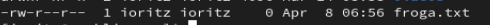
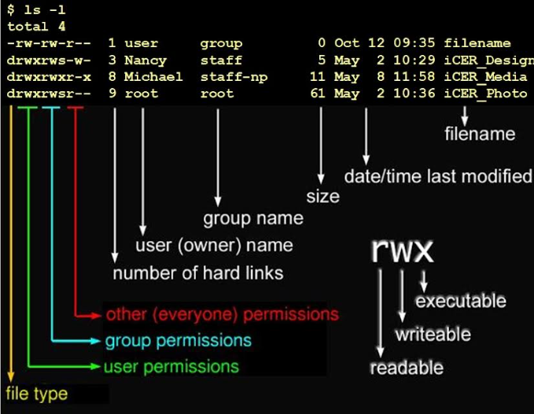
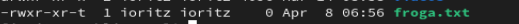
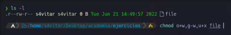

# Baimenak Linuxen
  
- [Baimenak Linuxen](#baimenak-linuxen)
  - [Fitxategi eta direktorioen baimenak](#fitxategi-eta-direktorioen-baimenak)
    - [Baimen taldeak](#baimen-taldeak)
    - [Baimenak esleitzen modu sinbolikoan](#baimenak-esleitzen-modu-sinbolikoan)
    - [Baimen Motak](#baimen-motak)
    - [`chmod` Agindua](#chmod-agindua)
    - [Adibideak](#adibideak)
    - [Baimenak modu oktalean](#baimenak-modu-oktalean)
  - [Sticky Bit](#sticky-bit)
  - [SUID eta GUID baimenak](#suid-eta-guid-baimenak)
    - [SUID](#suid)
  - [Ezaugarri bereziak - lsattr eta chattr](#ezaugarri-bereziak---lsattr-eta-chattr)
- [Ariketak](#ariketak)
  - [Ariketak 1](#ariketak-1)
- [Ariketa 2](#ariketa-2)
- [Ariketa 3](#ariketa-3)
- [Ariketa 4](#ariketa-4)
- [Ariketa 5](#ariketa-5)
- [Ariketa 6](#ariketa-6)
- [Ariketa 7](#ariketa-7)
  - [TALDE BAIMENAK](#talde-baimenak)
    - [TALDEA SORTU](#taldea-sortu)
    - [Erabiltzailea taldera ghitzeko](#erabiltzailea-taldera-ghitzeko)
    - [Erabiltzailearen taldeak ikusteko](#erabiltzailearen-taldeak-ikusteko)
    - [Taldeak ikusteko](#taldeak-ikusteko)
    - [Taldeak eta erabiltzaileak zerrendan ikusteko](#taldeak-eta-erabiltzaileak-zerrendan-ikusteko)

## Fitxategi eta direktorioen baimenak

Fitxategi eta direktorioen baimenak hurrengo aginduarekin ikusi ditzakegu.

```bash
ls -a
```



### Baimen taldeak

- **Jabea (user):** Fitxategi bat sortzen dugunean, sortzailea jabea izango da defektuz.
- **Taldea (group):** Fitxategi baten jabetza talde bati ere bai dagokio.
- **Besteak (other):** Jabeak edo taldekideak ez direnak



### Baimenak esleitzen modu sinbolikoan

Linuxen baimen motak eta `chmod` aginduaren erabilera oso garrantzitsuak dira sistema eragile batean fitxategiak eta direktorioak kudeatzeko. Hemen daude hauek azalpen labur batzuk:

### Baimen Motak

1. **Read (Irakurri)** (`r`): Baimen honekin erabiltzaileak fitxategia irakurri dezake.
   
2. **Write (Idatzi)** (`w`): Baimen honekin erabiltzaileak fitxategian edo direktorioan edukia idazteko aukera dauka.
   
3. **Execute (Exekutatu)** (`x`): Baimen honekin erabiltzaileak fitxategia exekutatu dezake. Adibidez, script-a exekutatu edo direktorioan sartu.

### `chmod` Agindua

`chmod` agindua Linuxen fitxategien eta direktorien baimenak aldatzeko erabiltzen da. Hemen daude adibide batzuk:

1. **Erabiltzaile, talde eta besteak baimenak aldatu:**
   ```bash
   chmod [baimenak] [fitxategia]
   ```

2. **Zehazki erabiltzaile, talde eta beste baimenak aldatu:**
   ```bash
   chmod [erabiltzaile baimenak][talde baimenak][besteak baimenak] [fitxategia]
   ```

3. **Erabiltzaile baimenak ikusi:**
   ```bash
   chmod u+r [fitxategia]
   ```

4. **Talde baimenak kendu:**
   ```bash
   chmod g-r [fitxategia]
   ```

5. **Exekutatze baimena ezarri denbora script-ari:**
   ```bash
   chmod +x [script-aren_izena]
   ```

6. **Erabiltzaile eta talde baimenak batera aldatu:**
   ```bash
   chmod ug+w [fitxategia]
   ```

### Adibideak

- **Fitxategia `script.sh`-ri exekutatze baimena emateko:**
  ```bash
  chmod +x script.sh
  ```

- **Fitxategia `datuak.txt`-ri irakurri, idatzi eta exekutatze baimenak emateko:**
  ```bash
  chmod u+rwx,g+rwx,o+rwx datuak.txt
  ```

Baimenak denboraren araberako arauak dira, eta Linuxen sistema eragileak segurtasun arauak betetzen dituzte. Baliteke aukera izatea erabiltzaile batzuek soilik fitxategi batzuen baimenak aldatzea edo exekutagarriak ezarri, beste erabiltzaileek fitxategi horiek soilik irakurtzea edo idazteko aukera izatea.

Adibidez, Jabeari (user) exekuzio baimena horrela eman ahal diogu.
```bash
chmod u+x froga.txt
```

Honela, taldeari eta besteei exekuzio eta idazteko baimenak emango dizkiogu.
```bash
chmod go+wx froga.txt
```

Besteei, irakurtzeko baimena horrela kenduko diezaiokegu.
```bash
chmod o-r froga.txt
```

### Baimenak modu oktalean

- 0 = 000 = --- = baimenik gabe
- 1 = 001 = --x = exekuzioa baimena
- 2 = 010 = -w- = idatezko baimena
- 3 = 011 = -wx = idazteko eta exekutatzeko baimena
- 4 = 100 = r-- = irakurtzeko baimena
- 5 = 101 = r-x = irakurtzeko eta exekutatzeko baimena
- 6 = 110 = rw- = irakurtzeko eta idazteko baimena
- 7 = 111 = rwx = baimen guztiak

Adibidez, baimen guztiak  kentzeko
```bash
chmod 000 froga.txt
```

Baimen guztiak
```bash
chmod 777 froga.txt
```

Erabiltzaileari baimena guztiak emateko eta besteei eta taldeari irakurtzeko eta exekutatzeko baimenak emateko
```bash
chmod 755 proga.txt
```

## Sticky Bit

Sticky bits daukan fitxategi edo direktorio bat bakarrik jabeak edo rootek ahalko du ezabatu edo izena aldatu.

Sticky bita gehitzeko

```bash
chmod +t froga.txt
```



## SUID eta GUID baimenak

### SUID

SUID aktibatuta dagoenean fitxategi hau exekutatzen duen erabiltzaileak sortzailearen baimenak izango ditu

```bash
chmod u+s froga.txt
```

Froga egiteko sortu exekutable bat hurrengo edukiarekin eta izenarekin

Suidfroga.sh

```bash
echo erabiltzailea
#!/bin/bash
id

echo $EUID
```

Ezarri SUID suidfroga.sh fitxategiari

```bash
chmod u+s suidfroga.sh
```

```bash
chmod 4755 suidfroga.sh
```

## Ezaugarri bereziak - lsattr eta chattr

Ezaugarri bereziak ikusteko `lsattr´ agindua erabiliko dugu

Ezaugarri bereziak aldatzeko `chattr´ agindua erabiliko dugu

- **i** ezaugarriarekin fitxategi bat inmutablea bilakatuko da. Inorrek ezingo du aldatu. Ezta rootek. Ezabatzeko i atributoa kendu beharko genuke.
```bash
chattr +i froga.txt
lsattr froga.txt
```

- **u** ezaugarriarenkin fitxategi bat ezabatzen dugunean datuak gordeta gelditzen dira eta berreskurapena ahalbidetzen du.
```bash
chattr +u froga.txt
```

- **e** ezaugarruarekin fitxategia ezabatzen denean, okupatzen zuen memoria zeroarekin berridazten da.

```bash
chattr +e froga.txt
```
- **c** ezaugarriarekin fitxategi bat konprimituta gordeko da.

```bash
chattr +c froga.txt
```

- **a** ezaugarriarekin fitxategi bati bakarrik gehitu ahal zaizkio gauzak, hau da, ezin da aurretik zegoen ezer aldatu.
  
```bash
chattr +a froga.txt
```

# Ariketak

## Ariketak 1

lotu dagokion baimenarekin:

- 462 --> r--rw--w-
- 123 --> ----w--wx
- 711 --> rwx--x--x
- 333 --> -wx-wx-wx
- 161 --> --xrw---x
- 765 --> rwxrw-r-x
- 567 --> r-xrw-rwx
- 101 --> --x-----x
- 162 --> --xrw--w-

Ebatzia:

- rwx--x--x --> 711
- --x-w--wx --> 123
- --x-----x --> 101
- -wx-wx-wx --> 333
- r-xrw-rwx --> 567
- rwxrw-r-x --> 765
- --xrw--w- --> 162
- r--rw--w- --> 362
- --xrw---x --> 161

# Ariketa 2

Zein da fitxategi honen baimenen baimena modu oktalean?



# Ariketa 3

Jarri hurrengo baimenak modu oktalean

- r--r-xrw-
- --xr-xr--
- r--------
- --------x
- rwsr-xr-x
- rwxr-sr-x
- r--rw---t

# Ariketa 4

Zer gertatuko da hurrengo agindua exekutatzerakoan?


1. 'Whoami' komandoaren output-a file fitxategian gordeko da, fitxategiaren jabea izateagatik baimenek ez baitidate eragiten

2. 'Whoami' komandoaren output-a ezin izango da file fitxategian gorde, jabea izan arren, fitxategian esleitutako baimena gailentzen delako

# Ariketa 5

Nola lortuko zenuke "file" artxiboaren baimenak ikusten den moduan aldatzeko?


# Ariketa 6

Zortzitarrean zer baimen esleitu beharko dut artxiboak adierazitako baimenak izan ditzan lortzeko?


# Ariketa 7

Honako baimen hauek konfiguratuta dituen fitxategi hau ezabatu ahal izango dut?


1. Bai
2. Ez


## TALDE BAIMENAK

### TALDEA SORTU

```bash
groupadd (taldearen izena)
```

### Erabiltzailea taldera ghitzeko

```bash
usermod -aG ikaslea, Gaizka (taldea+erabiltzailea)
```

### Erabiltzailearen taldeak ikusteko

```bash
groups gaizka
```

### Taldeak ikusteko

```bash
cat /etc/groups
```

### Taldeak eta erabiltzaileak zerrendan ikusteko

```bash
cat /etc/groups
```